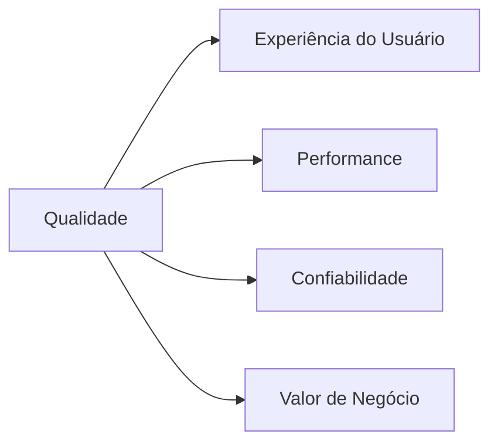

<h1 align="center">✨ Bem-vindo(a) ao meu GitHub!</h1>

<p align="center">
  
</p>

---

## 👋 Olá, eu sou o Felipe Freitas

💻 **Analista de Qualidade de Software**  
📈 +2 anos garantindo entregas **estáveis, performáticas e confiáveis**

---

## 🧠 Sobre mim

```diff
+ Focado em qualidade e experiência do usuário
+ Mentalidade preventiva (evitar bug > corrigir bug)
+ Evolução constante com base em prática real
```

---

🧪 O que eu faço

<table>
<tr>
<td>🔍 <strong>Testes</strong></td>
<td>Funcionais, integração, regressão e exploratórios</td>
</tr>
  
<tr>
<td>🎨 <strong>UI/UX QA</strong></td>
<td>Validação pixel-perfect com Figma</td>
</tr>

<tr>
<td>🤖 <strong>Automação</strong></td>
<td>Cypress + monitoramento com Datadog</td>
</tr>

<tr>
<td>🔗 <strong>APIs</strong></td>
<td>Testes e validações com Postman</td>
</tr>

<tr>
<td>🚀 <strong>Performance</strong></td>
<td>Testes de carga com K6</td>
</tr>

<tr>
<td>📄 <strong>Documentação</strong></td>
<td>Confluence (clara e colaborativa)</td>
</tr>

<tr>
<td>📊 <strong>Gestão</strong></td>
<td>Jira (bugs, histórias e priorização)</td>
</tr>

<tr>
<td>🧠 <strong>Qualidade</strong></td>
<td>BDD e ATDD aplicados na prática</td>
</tr>
</table>

---

⚙️ Stack & Ferramentas

<p align="center">
  
  
  
  
  
  
  
</p>

---

## 🔄 Metodologias

| 🏗️ Metodologia | 🎯 Aplicação |
|---|---|
| Scrum | Entregas iterativas e alinhamento contínuo |
| Kanban | Fluxo contínuo e organização de tarefas |
| BDD | Testes baseados em comportamento |
| ATDD | Critérios de aceitação claros |
| CI/CD | Qualidade integrada ao fluxo de deploy |

---

## 📊 Meu foco como QA

---

## 📫 Contato

<div align="center">

| 📧 Email | 📱 WhatsApp | 🔗 LinkedIn |
|---|---|---|
| [felipefregeni@hotmail.com](mailto:felipefregeni@hotmail.com) | (11) 97440-2293 | [felipefreitasgenitore](https://www.linkedin.com/in/felipefreitasgenitore/) |

<br/>

[](https://www.linkedin.com/in/felipefreitasgenitore/)
[](mailto:felipefregeni@hotmail.com)

</div>

---

<div align="center">
  <sub>⭐ Se algum repositório te ajudou, deixa uma estrela — isso faz diferença!</sub>
</div>
